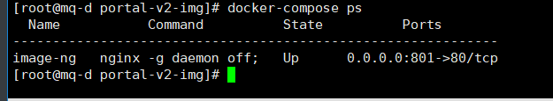

MaxISP安装部署文档

---

## 环境信息

* centos  

  CentOS Linux release 7.4.1708 (Core)

* mysql

  5.7.21

* docker

  Docker version 18.03.1-ce

* docker-compose

  docker-compose version 1.24.0

---

## docker-compose安装教程

* 直接修改版本安装

  sudo curl -L https://github.com/docker/compose/releases/download/1.24.0/docker-compose-uname -s-uname -m -o /usr/local/bin/docker-compose

* 赋予权限

  sudo chmod +x /usr/local/bin/docker-compose

---

## 相关脚本讲解

* docker-compose.yml

  上面配置了docker容器的相关信息，用来启动docker容器，在该目录可以使用如下命令:

  docker-compose up -d: 容器启动（-d表示后台运行，首次启动建议不加-d，看是否报错）

  docker-compose down: 容器停止（会停止docker-compose.yml配置的所有容器，小心使用）

  docker-compose ps: 查看容器运行情况

* nginx.conf

  nginx容器的配置文件，反向代理的作用

## 脚本参数修改（var_: 修改的变量）

* portal-admin-v2目录下docker-compose.yml替换如下变量(如果数据没有从节点，即可删除从节点配置):
```yml
version: '3'
services:

  maxbase-portal-admin-v2:
    container_name: maxbase-portal-admin-v2
    image: var_image  #容器镜像名，如：maxbase-portal-admin:1.0.1
    privileged: true
    ports:
      - var_port:10019  #后端容器端口号，如10005:10019
    volumes:
      - /opt/logs/maxbase-portal-admin-v2:/opt/logs/maxbase-portal-admin-v2
      - /opt/portal-v2-img:/app/img
    environment:
      - SQL_ENV_NAME=dev
      - SHOW_VERIFY_CODE=true
      - MASTER_MYSQL_HOST=var_mysql_ip  #mysql主节点ip，如：192.168.11.1
      - MASTER_MYSQL_PORT=3306
      - MASTER_MYSQL_USERNAME=var_mysql_username  #mysql主节点账号
      - MASTER_MYSQL_PASSWORD=var_mysql_password   #mysql主节点密码
      - SLAVE_MYSQL_HOST=var_mysql_ip   #mysql子节点ip
      - SLAVE_MYSQL_PORT=3306
      - SLAVE_MYSQL_USERNAME=var_mysql_username  #mysql子节点账号
      - SLAVE_MYSQL_PASSWORD=var_mysql_password  #mysql子节点密码
      - LOG_PATH=/opt/logs/maxbase-portal-admin-v2
      - LOG_FILE=maxbase-portal-admin-v2
      - LOG_MAX_FILE_SIZE=100MB
      - LOG_MAX_HISTORY_DAYS=30
      - LOG_ROOT_LEVEL=info
      - FILE_RANDOM_PATH=/app/img/random/
      - FILE_ASSIGNATION_PATH=/app/img/assignation/
      - TZ=Asia/Shanghai

```

* portal-ms-web-v2目录下docker-compose.yml替换如下变量:

  ```yml
  version: '3'
  services:
  
    maxbase-portal-ms-web-v2:
      container_name: maxbase-portal-ms-web-v2i
      image: var_image #镜像名
      privileged: true
      ports:
        - var_port:443 #前端的变量，例如700:443
      environment:
        - TZ=Asia/Shanghai
      volumes:
        - ./nginx.conf:/etc/nginx/nginx.conf 
  ```
  
* web-portal-v2目录下docker-compose.yml替换如下变量:

  ```yml
  version: '3'
  services:
  
    web-portal-v2:
      container_name: web-portal-v2
      image: var_image #镜像名
      privileged: true
      ports:
        - var_port:443 #前端端口号
      environment:
        - TZ=Asia/Shanghai
      volumes:
        - ./nginx.conf:/etc/nginx/nginx.conf 
  
  ```
  
* portal-ms-web-v2、web-portal-v2目录下nginx.conf文件更换变量:

  ```nginx
  
          location /portal-v2/ {
                proxy_pass http://var_ip:var_port;
  #######
  ###  var_ip指后端容器ip；
  ###  var_port指上面后端docker-compose.yml文件设置的端口号；
  #######
          }
          location /api/ {
                proxy_pass http://var_ip:var_port;
          }
  #######
  ###  var_ip指后端容器ip；
  ###  var_port指上面后端docker-compose.yml文件设置的端口号；
  #######
  
  ```

---

## 部署流程

* 启动容器

  1. 进入docker-compose.yml所在目录

     cd portal-admin-v2 

  2. 启动容器

     docker-compose up （看是否报错，如果没报错，进行下一步）

  3. docker-compose down

  4. docker-compose up -d

     

     如果显示up，则容器运行成功

---

## 测试

进入对应的页面进行登录测试

* 前端页面测试

  https://va_ip:var_port            //对应前面设置的ip和地址

* 如果页面能打开，然后进行登录，如果登录成功，并显示成功，则后端测试成功

  用户：admin

  密码：123456

* 进行功能测试，如图片上传等等
