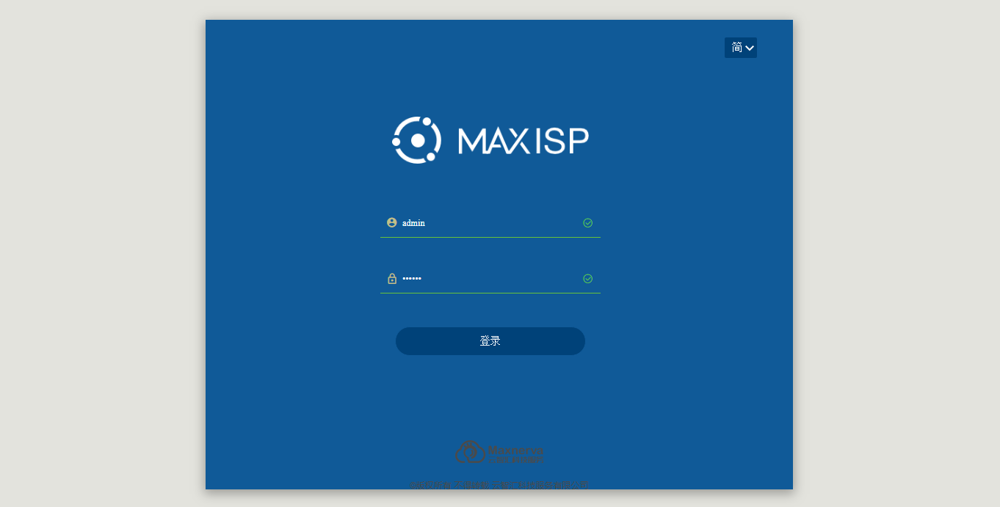
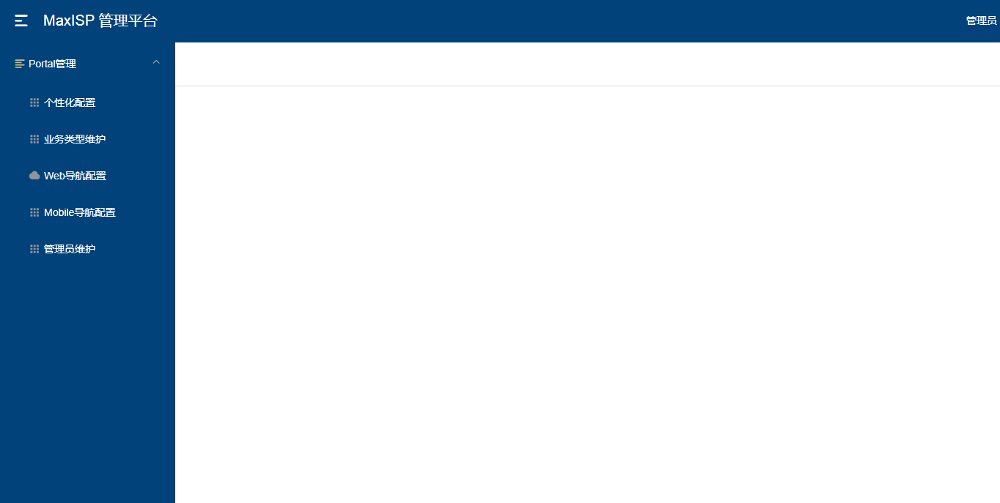
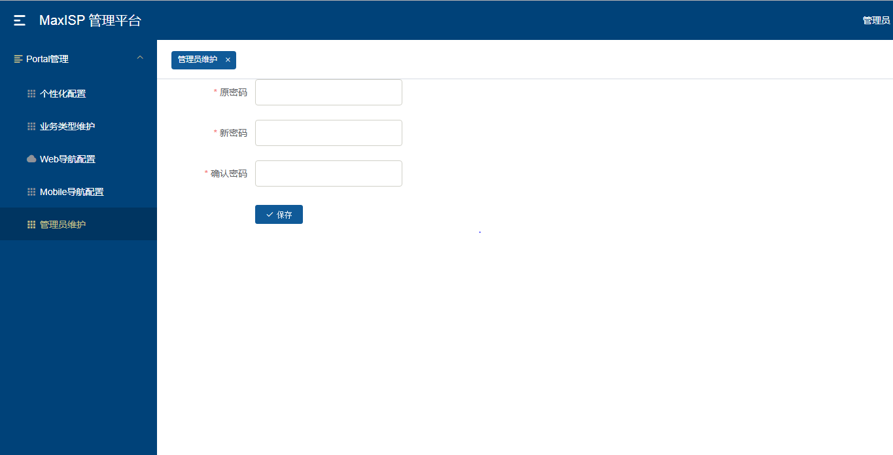

# **MaxISP使用说明**
[TOC]
##功能简介
MaxISP(Maxnerva Internet Service Protal)作为一款轻量型工具，能帮助企业实现快速整合信息系统资源，一键式登录、统一及模块化管理；作为统一的信息系统登录门户网站。

###系统配置管理（管理员）
以管理员默认账号、密码(admin\123456)登录系统配置管理页面。

登录成功后进入系统配置管理界面，点击**Protal**展开功能菜单。

####管理员维护
进入**管理员维护**功能菜单，维护管理员的新密码。
管理员账号为**admin**不变。

####个性化配置
通过**个性化配置**功能菜单，维护客制化的用户登录门户系统页面。

#####配置门户系统名称
进入**个性化配置**功能菜单，配置门户系统名称。
修改**关键字:system_name**条目的**关键值**。
修改方式，点击最右侧编辑按钮，进入编辑页面，修改"关键值“后保存。
比如修改原有值为：Foxconn工业互联网6流门户。

修改成功后，在用户登录的系统页面首页即可看到配置的新的系统名称。

#####配置门户系统图片
进入**个性化配置**功能菜单，配置门户系统图片。
修改**关键字:index_img**条目的**关键值对应的图片**。

点击**图片**，从本机选择目标图片更新到系统中。
**备注：图片分辨率建议为**：1760x864 

此时Index_img的图片已更新为最新的图片，点击**保存**返回功能菜单。
修改成功后，在用户登录的系统页面导览首页即可看到配置的新的系统政令（门户）图片。

####业务类型维护
在业务类型维护功能菜单，通过配置业务类型，可以根据组织业务类型或是自己的安排配置系统功能类型，用来作为系统门户的业务模块名称或是系统功能模块名称
打开**业务类型维护**功能菜单，对业务类型进行配置。

#####添加
点击**添加**按钮，添加一笔业务类型。
**业务类型名称**:用户页面的系统模块Tab名称。
**平台**:目前支持两种，分别是Web(PC端)与Mobile(移动应用端)，供用户登录。在配置的过程中根据组织整合系统门户的规划进行选择。
**显示顺序**:业务模块在系统页面的显示顺序，排列顺序按照从小到大排列。
比如:

信息填写完成后，点击保存，返回功能菜单页面。

创建的业务类型在后续**Web导航配置**，**Mobile导航配置**会被使用。

#####编辑
在业务类型清单中选中待编辑的条目，点击**编辑**按钮，进入编辑界面。

信息编辑完成后点击保存，返回功能菜单页面。

#####删除
在业务类型清单中选中待编辑的条目，点击**删除**按钮，即可删除条目。

#####取消
在编辑页面除了保存按钮外，都有**删除**按钮，点击删除按钮，取消当前的信息编辑。

####Web 导航配置
进入**Web导航配置**功能菜单，对Web(PC)待要整合的信息系统进行统一管理。

#####添加
点击**添加**按钮，添加待管理的一笔系统信息。
**编码**：被管理的系统编码，由组织自行根据自己的系统管理规则给系统分配一个编码，用于管理。
**名称**：被管理的系统名称。
**业务分类**：业务类型维护功能菜单中所维护的业务类型清单。
**排序**：根据一个具体的业务分类模块中，已被管理的系统添加顺序，默认值为**最后**，若需调整顺序则在已有的被管理系统的顺序中，进行排序号选择，进行排序调整。
**状态**：目前支持两种状态，分别是**正常**与**开发中**。
​        正常--在用户页面，系统可见，也可以访问，用户正常使用的系统。
​        开发中--在用户页面，系统可见，还不能访问，用户还正在开发中的系统。

**描述**：被管理系统的描述。
**图标**：被管理系统的图标，从本机电脑上传添加。
**WebUrl**：被管理系统的URL地址。
**App下载url**：被管理系统如果有移动版本，此处为移动版本APP的下载地址。

信息编辑完成后，点击保存，返回菜单页面。

结合前面的操作步骤，在用户登录的系统页面中，被管理的信息如下：

点击**Web**访问系统的Web页面。
点击**App下载**弹出供移动应用下载APK的二维码图片，供移动设备扫描后进行应用下载。
**备注**：目前仅支持安卓应用下载

#####编辑
在功能菜单中的应用系统清单中选中待编辑的系统，点击**编辑**按钮，对该系统的信息进行编辑。

修改完成后点击保存，返回功能菜单。

#####删除
在功能菜单中的应用系统清单中选中待编辑的系统，点击**删除**按钮，删除被管理的系统。

被管理的系统被删除后，将从用户系统页面删除。

#####取消
在被管理信息的编辑页面除了有**保存**按钮，亦存在**取消**按钮，点击取消按钮，取消当前待编辑的信息更新，返回功能菜单。

####Mobile 导航配置
进入**Mobile导航配置**功能菜单，对待要整合的基于移动设备的信息系统进行统一管理。

#####添加
点击**添加**按钮，添加待管理的一笔系统信息。
**编码**：被管理的系统编码，由组织自行根据自己的系统管理规则给系统分配一个编码，用于管理。
**名称**：被管理的系统名称。
**业务分类**：业务类型维护功能菜单中所维护的业务类型清单。
**排序**：根据一个具体的业务分类模块中，已被管理的系统添加顺序，默认值为**最后**，若需调整顺序则在已有的被管理系统的顺序中，进行排序号选择，进行排序调整。
**描述**：被管理系统的描述。
**图标**：被管理系统的图标，从本机电脑上传添加。
**URL**：被管理系统的URL地址。

信息编辑完成后，点击保存，返回菜单页面。

结合前面的操作步骤，在移动设备用户登录的系统页面中，被管理的信息如下：

在给定的业务类型模块中:

#####编辑
在功能菜单中的应用系统清单中选中待编辑的系统，点击**编辑**按钮，对该系统的信息进行编辑。

修改完成后点击保存，返回功能菜单。

#####删除
在功能菜单中的应用系统清单中选中待编辑的系统，点击**删除**按钮，删除被管理的系统。

被管理的系统被删除后，将从用户系统页面删除。

#####取消
在被管理信息的编辑页面除了有**保存**按钮，亦存在**取消**按钮，点击取消按钮，取消当前待编辑的信息更新，返回功能菜单。

###整合系统统一登录门户(Web)
用户打开配置好后的门户网站URL,即可以登录整合好后的统一系统登录门户，登录待使用系统。
####导览
用户看到的整合系统的政令文档、宣传图片。

####所有服务
根据组织的业务模块，查看到对应的系统，并根据Web或APP登录登录对应子系统或获得APP的下载二维码。

#####Web
点击**Web**按钮,浏览器导航到对应系统的登录页面。

#####APP
点击**App下载**按钮，弹出对应APK下载路径对应的二维码图片，供用户在移动设备中下载使用。

###整合系统统一登录门户(Mobile)
用户打开配置好后的移动门户网站URL,即可以登录整合好后的移动应用统一登录门户。

也可以在移动设备上通过切换业务模块进入指定的系统。

